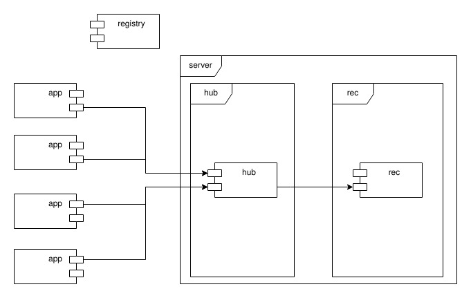

*Bicloin*: primeira parte
=========================

Este documento apresenta a primeira parte do projeto *Bicloin*, onde se descreve o contexto, os componentes da arquitetura e os requisitos funcionais a satisfazer.

1 Introdução
------------

O sistema *Bicloin* permite aos utilizadores comprarem pontos -- chamados **bicloins** ou BIC -- que podem depois gastar para alugar bicicletas.

1.1 Utilizadores
----------------

Cada utilizador tem uma conta no sistema, identificada por um identificador alfanumérico, com comprimento mínimo de 3 e máximo de 10 caracteres.
Além do identificador, cada utilizador tem o seu nome (texto com comprimento mínimo de 3 e máximo de 30 caracteres) e um número de telemóvel (com código de país sempre incluído).

A tabela seguinte apresenta os dados de um conjunto de utilizadores ([users.csv](users.csv)).

| Utilizador | Nome             | Telemóvel     |
|------------|------------------|---------------|
| alice      | Alice Andrade    | +35191102030  |
| bruno      | Bruno Benavente  | +35193334444  |
| carlos     | Carlos Cardoso   | +34203040     |
| diana      | Diana Damião     | +34010203     |
| eva        | Eva Ernesto      | +155509080706 |

A cada conta está associado um saldo, que começa com 0 (zero) BIC.

Podem ser feitos carregamentos de *bicloins* através de um sistema similar ao [MBWay](https://www.mbway.pt/funcionalidades/), sendo a taxa de conversão de **1 EUR para 10 BIC**.  
Só é possível fazer carregamentos com valores inteiros, entre 1 e 20 EUR, inclusivé.

1.2 Estações
------------

O sistema tem uma rede de estações distribuídas por uma área geográfica urbana.
Cada estação tem um conjunto de docas, nas quais são colocadas as bicicletas partilhadas.
Num dado momento, cada doca pode estar livre ou ocupada por uma bicicleta.

Além do número de docas e de bicicletas, cada estação tem outros atributos relevantes: o seu nome, a sua abreviatura (que é formada por 4 caracteres alfanuméricos, e que pode ser usada como identificador único), as coordenadas geográficas em [notação decimal](https://en.wikipedia.org/wiki/Decimal_degrees) e o prémio de entrega (explicado mais adiante).

A tabela seguinte apresenta um conjunto de estações na cidade de Lisboa ([stations.csv](stations.csv)).

| Nome da estação   | Abrev. | Coordenadas      | Nr. docas | Nr. bicicletas | Prémio |
|-------------------|:------:|------------------|----------:|---------------:|-------:|
| Oceanário         | ocea   | 38.7633, -9.0950 | 20        | 15             | 2      |
| IST Alameda       | ista   | 38.7369, -9.1366 | 20        | 19             | 3      |
| Gulbenkian        | gulb   | 38.7376, -9.1545 | 30        | 30             | 2      |
| Sé Catedral       | cate   | 38.7097, -9.1336 | 10        | 0              | 2      |
| Praça Comércio    | prcm   | 38.7075, -9.1364 | 30        | 20             | 1      |
| Cais Sodré        | cais   | 38.7060, -9.1441 | 50        | 33             | 1      |
| Jerónimos         | jero   | 38.6972, -9.2064 | 30        | 20             | 3      |
| Sto. Amaro Oeiras | stao   | 38.6867, -9.3124 | 30        | 20             | 3      |
| IST Taguspark     | istt   | 38.7372, -9.3023 | 20        | 12             | 4      |

1.3 Aluguer de bicicletas
-------------------------

Quando um utilizador se aproxima de uma estação com bicicletas disponíveis, pode pedir para levantar uma dessas bicicletas.
O custo de aluguer são 10 BIC, debitados no momento.
No processo de aluguer o saldo do utilizador não pode ficar negativo.

Posteriormente, o utilizador deve devolver a bicicleta numa estação que tenha pelo menos uma doca livre.
Ao devolver a bicicleta, o utilizador recebe o prémio de entrega definido na estação de destino, que é creditado no momento.
O prémio de devolução deve ser sempre positivo, para encorajar os utilizadores a devolver bicicletas, especialmente em estações mais remotas.

----

2 Arquitetura do sistema
------------------------

A figura seguinte mostra uma visão global dos componentes da solução a construir.
Podem existir várias aplicações móveis `app`, um ou mais `hub`, um `rec` (para já) e um serviço de nomes (*registry*).

Por simplificação, a aplicação móvel tem uma interface de linha de comando, em vez de uma interface gráfica para Android ou iOS.

Os pedidos das aplicações móveis são encaminhados para um `hub`, que oferece um conjunto de procedimentos remotos aos utilizadores.
O `hub` contém apenas informação da aplicação que é **imutável**, ou seja, é preenchida uma primeira vez, e depois não muda mais.

O armazenamento de informação mutável é feito no `rec` (abreviatura de *record*).
O `rec` oferece procedimentos remotos básicos de leitura/escrita de registos, em que cada registo tem um identificador único (textual, sem espaços) e um valor.

Os `hub` e `rec` registam-se no *registry*, que é um **serviço de nomes**.
Apenas o endereço e porto do *registry* deve ser conhecido à partida.
Todos os restantes nomes de máquinas e portos devem ser obtidos dinamicamente por consulta do *registry*.

2.1 Servidor *hub*
-------------------

O servidor `hub` deve disponibilizar os seguintes procedimentos remotos:

-   `balance` -- recebe o identificador do utilizador e devolve o saldo atual de *bicloins* na sua conta;

-   `top_up` --  recebe o identificador do utilizador, o montante a carregar e o número de telemóvel para ativar a aplicação de pagamentos.
Devolve o saldo após o carregamento.
O número fornecido deve corresponder ao número associado ao utilizador.
Por simplificação, assume-se que o carregamento é sempre bem sucedido e não existe necessidade de contactar um serviço de pagamentos;

-   `info_station` -- recebe um identificador de estação e devolve informação sobre a estação, incluindo as estatísticas de utilização.
Os atributos retornados incluem o nome, as coordenadas, a capacidade das docas, o prémio, e o número de bicicletas disponíveis.
As estatísticas são o número acumulado de levantamentos e de entregas;

-   `locate_station` -- recebe as coordenadas do utilizador e lista as *k* estações (*k* é dado como argumento) mais próximas.
As estações são retornadas por ordem crescente da distância às coordenadas indicadas.
Para cada estação, é indicado **apenas** o seu **identificador** no resultado.
Para calcular a distância entre coordenadas, deve ser usada a [fórmula de haversine](https://pt.wikipedia.org/wiki/F%C3%B3rmula_de_haversine);

-   `bike_up` e `bike_down` -- recebem o identificador do utilizador, as suas coordenadas atuais, e a estação de onde se pretende levantar (`bike_up`) ou entregar (`bike_down`) uma bicicleta.
O utilizador deve estar na proximidade da estação (a menos de 200 metros).
Um utilizador apenas pode levantar uma bicicleta de cada vez;

-   `ping` -- recebe um pedido de sinal de vida e responde com uma mensagem indicando o estado do servidor;

-   `sys_status` -- recebe um pedido de ponto de situação do sistema como um todo.
Contacta todos os `hub` e `rec` registados no serviço de nomes.
Para cada servidor deve ser indicado o seu nome (*path*) e se está a responder (*up*) ou não (*down*).

### Definição de mensagens remotas

Os resultados dos procedimentos de pesquisa devem ser devolvidos em mensagens estruturadas, com campos individuais para cada atributo.
Para cada campo deve ser escolhido o tipo de dados mais adequado, evitando o uso excessivo do tipo *string*.

### Testes de integração

O `hub-tester` deve ser desenvolvido para albergar *testes de integração* (IT -- *Integration Tests*) que permitam verificar o funcionamento correto dos procedimentos remotos do servidor.  

### Réplicas do *hub*

(*OPCIONAL*: este requisito só vai ser avaliado na segunda parte do projeto)

Para tolerar faltas do `hub` devem existir várias cópias (chamadas *réplicas*) do servidor a correr ao mesmo tempo.
Como o `hub` tem estado imutável, basta lançar mais uma instância, carregada com os mesmos dados.

### Argumentos

O `hub` deverá receber como argumentos na linha de comando, o servidor e o porto do *ZooKeeper*, o servidor e o porto do próprio, o número de instância, os ficheiros de dados e a opção de inicialização de registos.

Por exemplo, o primeiro servidor pode ser lançado da seguinte forma ($ representa a _shell_ do sistema operativo):

    $ hub localhost 2181 localhost 8081 1 users.csv stations.csv initRec

O segundo servidor pode ser lançado da seguinte forma:

    $ hub localhost 2181 localhost 8082 2 users.csv stations.csv

E assim sucessivamente.

Caso exista algum problema com os ficheiros de dados, o arranque do servidor deve ser cancelado.

Caso a opção `initRec` seja indicada, o `hub` deve contactar o `rec` para criar todos os registos mutáveis necessários, com valores iniciais, com base nos valores por omissão ou nos valores indicados nos ficheiros de dados.
Caso contrário, os registos existentes no `rec` devem ser mantidos.
Isto permite distinguir quando se está a fazer o lançamento inicial ou quando se está a lançar ou recuperar uma réplica.

2.2 Servidor `rec`
-----------------

O `rec` deve disponibilizar os seguintes procedimentos remotos:

- `read` -- recebe o nome do registo, e devolve o valor atual;

- `write` -- recebe o nome do registo e valor a escrever;

- `ping` -- recebe um pedido de sinal de vida e responde.

Os registos são implicitamente criados da primeira vez que existe um acesso com o seu nome, seja uma escrita ou uma leitura.
Quando um registo é criado por uma leitura, deve ser preenchido com um valor por omissão que simbolize *vazio*.

### Testes de integração

Deve ser criado o módulo `rec-tester` para conter testes de integração do `rec`.

### Argumentos

O `rec` deverá receber como argumentos na linha de comando, o servidor e o porto do *ZooKeeper*, o servidor e o porto do próprio, e o número de instância.

    $ rec localhost 2181 localhost 8091 1

2.3 Serviço de nomes
--------------------

(*OPCIONAL*: este requisito só vai ser avaliado na segunda parte do projeto)

Cabe a cada servidor, quando lançado, registar-se a si próprio no serviço de nomes.
Os nomes a usar para registar os `hub` são: `/grpc/bicloin/hub/1`, `/grpc/bicloin/hub/2`, e assim sucessivamente.
O `rec` deve ser registado com o nome: `/grpc/bicloin/rec/1`.

O servidor de nomes a usar é o [*ZooKeeper*](https://zookeeper.apache.org/).
Para simplificar o código de acesso ao servidor, deve ser usada a biblioteca [ZKNaming](https://github.com/tecnico-distsys/naming).

A informação presente no *ZooKeeper* pode estar desatualizada.
Por exemplo, pode suceder uma réplica estar registada, mas já ter sofrido uma falha.

A `app` deve consultar o *ZooKeeper* e depois escolher uma qualquer réplica `hub` disponível.
Se a réplica escolhida não responder, deve contactar outra réplica, de forma transparente para o utilizador.
Para efeitos de demonstração desta funcionalidade, deverá ser impressa uma mensagem de erro para cada tentativa (apenas 1 linha de texto).

2.4 *app*
-----------------

A *app* tem uma interface-utilizador textual, de linha de comando.
O programa deve ler do *standard input* linhas de texto, uma a uma, sendo que cada linha corresponde a um comando.

### Argumentos

A *app* deverá receber como argumentos na linha de comando, o servidor e o porto do *ZooKeeper*, o identificador e telemóvel do utilizador e as coordenadas onde está localizado.

Por exemplo, a *app* pode ser lançada da seguinte forma:

    $ app localhost 2181 alice +35191102030 38.7380 -9.3000

Depois de lançada, surge a *prompt* `>`.
A aplicação aceita comandos em linhas de texto, com os campos separados por ` ` (espaço).

### Comandos

Consultar o saldo de *bicloins*:

    > balance
    alice 0 BIC

Carregar 15 Euros em *bicloins*:

    > top-up 15
    alice 150 BIC

Criar uma etiqueta para coordenadas e depois usar a etiqueta para movimentações:

    > tag 38.7376 -9.3031 loc1
    OK
    > move loc1
    alice em https://www.google.com/maps/place/38.7376,-9.3031

Apresentar a localização atual do utilizador:

    > at
    alice em https://www.google.com/maps/place/38.7376,-9.3031

Listar as *n* estações mais próximas (*n*=3 no exemplo seguinte):

    > scan 3
    istt, lat 38.7372, -9.3023 long, 20 docas, 4 BIC prémio, 12 bicicletas, a 82 metros
    stao, lat 38.6867, -9.3124 long, 30 docas, 3 BIC prémio, 20 bicicletas, a 5717 metros
    jero, lat 38.6972, -9.2064 long, 30 docas, 3 BIC prémio, 20 bicicletas, a 9517 metros

As estações aparecem listadas, uma por linha, com os seguintes atributos (separados por vírgula e espaço):
identificador, coordenadas, capacidade, prémio, número de bicicletas disponíveis, e distância para a posição do utilizador.

Listar informação de uma estação:

    > info istt
    IST Taguspark, lat 38.7372, -9.3023 long, 20 docas, 4 BIC prémio, 12 bicicletas, 22 levantamentos, 7 devoluções, https://www.google.com/maps/place/38.7372,-9.3023

Levantar bicicleta da estação indicada e pedalar para outra posição:

    > bike-up istt
    OK
    > move 38.6867 -9.3117
    alice em https://www.google.com/maps/place/38.6867,-9.3117

Devolver a bicicleta (é necessário estar próximo da estação):

    > bike-down istt
    ERRO fora de alcance
    > bike-down stao
    OK

A regra para as mensagens de confirmação de comandos é começar a linha com `OK` ou `ERRO`, seguido de mais texto, sempre que seja útil, mas ocupando apenas uma linha de texto.

### Redirecionamento de dados

É possível enviar o conteúdo de um ficheiro de texto para o programa, com o operador de redirecionamento `<` da _shell_ do sistema operativo:

    $ app localhost 2181 bruno +35193334444 38.737613 -9.303164 < commandos.txt

O conteúdo do ficheiro [comandos.txt](comandos.txt) é enviado para o programa, tal como se estivesse a ser teclado, o que permite automatizar sequências de utilização.  
Existem também linhas especiais:  
linhas começadas por `#` são comentários;  
linhas começadas por `zzz` seguido de um número inteiro de milisegundos devem causar uma pausa no processamento (*sleep*) com a respetiva duração.

### Comandos adicionais

A *app* deve também ter os comandos `ping` e `sys_status` que permitem chamar os respetivos procedimentos remotos.
Podem ser acrescentados mais comandos, desde que sejam explicados no comando `help`.

----

3 Tecnologia
------------

Todos os componentes do projeto têm de ser implementados na linguagem de programação [Java](https://docs.oracle.com/javase/specs/).  
A ferramenta de construção a usar, obrigatoriamente, é o [Maven](https://maven.apache.org/).  
A biblioteca de testes recomendada é o [JUnit](https://junit.org/), mas pode ser usada uma equivalente.  

### Chamadas de procedimentos remotos

A chamada de procedimentos remotos deve ser suportada por [gRPC](https://grpc.io/).  
As mensagens devem ser descritas com [*protocol buffers*](https://developers.google.com/protocol-buffers), a definir por cada grupo.
Não existem contratos de serviço pré-definidos.
Os contratos devem tirar partido do sistema de tipos de dados dos *protocol buffers*
(c.f. `google.protobuf.Timestamp`, `google.type.Money`, `com.google.protobuf.Any`, etc.)

### Validações 

Os argumentos dos procedimentos remotos devem ser validados obrigatóriamente e de forma estrita pelos servidores, devolvendo erros sempre que necessário.

### Faltas

Se durante a execução surgirem faltas, ou seja, acontecimentos inesperados, o programa deve apanhar a exceção produzida, imprimir informação de forma sucinta (1 linha de texto) e parar de executar o procedimento.

### Persistência

Não se exige nem será valorizado o armazenamento persistente do estado dos servidores.

4 Resumo
--------

Em resumo, na primeira parte do trabalho, é necessário implementar:  
o `hub`, `hub-tester`, `rec`, `rec-tester` e a `app`.

----

5 Avaliação
-----------

5.1 Fotos
---------

Cada membro da equipa tem que fornecer uma foto, com qualidade, tirada no último ano, para facilitar a identificação e comunicação.
A identificação e foto deve ser colocada na pasta `report/`.
Como referência, pode ser consultado o [relatório de exemplo](report/README.md).
Para esta primeira parte deve ser preenchida apenas a secção **Autores**.

5.2 Identificador de grupo
--------------------------

O identificador do grupo tem o formato `CXX`, onde: `C` representa o campus (A para Alameda e T para Taguspark) e `XX` representa o número do grupo de SD atribuído pelo Fénix.  
Por exemplo, o grupo A22 corresponde ao grupo 22 sediado no campus Alameda; já o grupo T07 corresponde ao grupo 7 sediado no Taguspark.

O grupo deve identificar-se no documento `README.md` na pasta raíz do projeto.

Em todos os ficheiros de configuração `pom.xml` e de código-fonte, devem substituir `CXX` pelo identificador de grupo.  
Esta alteração é importante para a gestão de dependências, para garantir que os programas de cada grupo utilizam sempre os módulos desenvolvidos pelo próprio grupo.

5.3 Colaboração
---------------

O [Git](https://git-scm.com/doc) é um sistema de controlo de versões do código fonte que é uma grande ajuda para o trabalho em equipa.
Toda a partilha de código para trabalho deve ser feita através do [Git da RNL](https://git.rnl.tecnico.ulisboa.pt).

O repositório de cada grupo estará disponível em: https://git.rnl.tecnico.ulisboa.pt/distsys/CXX-Bicloin/ (substituir `CXX` pelo identificador de grupo).

A atualização do repositório deve ser feita com regularidade, correspondendo à distribuição de trabalho entre os membros da equipa e às várias etapas de desenvolvimento.
Cada elemento do grupo deve atualizar o repositório do seu grupo à medida que vai concluindo as várias tarefas que lhe foram atribuídas.

Propõe-se a seguinte divisão de tarefas:

- bloco central (_a fazer por toda a equipa em conjunto_)
    - *protocol buffers* do `hub` e do `rec`;
    - definição das estruturas de dados internas aos servidores;
    - pseudo-código dos procedimentos a realizar;
    - implementação dos procedimentos remotos `ping` e `sys_status`;
- bloco T1 - procedimentos `read`, `write` do `rec` e `hub-tester`;
- bloco T2 - procedimentos `balance`, `top-up`, `bike-up` e `bike-down` do `hub` e testes `rec-tester`;
- bloco T3 - procedimentos `info_station`, `locate_station` do `hub` e a `app`.

Cada membro da equipa deve liderar um dos blocos de tarefas T1, T2 ou T3.
O responsável por cada bloco de tarefas deve ser identificado no ficheiro `README.md` do projeto.

5.4 Entregas
------------

As entregas do projeto serão feitas também através do repositório Git.
Cada grupo tem que marcar o código de cada entrega com a [*tag*](https://git-scm.com/book/en/v2/Git-Basics-Tagging) `SD_P1`, antes da hora limite de entrega.

5.5 Valorização
---------------

A primeira parte vale 10 valores em 20, distribuídos da seguinte forma:

-   `rec` (1 valor)

-   `rec-tester` -- cliente e testes de integração (1 valor)

-   `hub` -- implementação dos procedimentos remotos (2 valores)

-   `hub-tester` -- cliente e testes de integração (1 valor)

-   `app` (2 valores)

-   Guião de demonstração (1 valor)

-   Qualidade do código -- de todos os componentes (2 valores)

A data limite de entrega é: **sexta-feira, 16 de abril de 2021, 17:00**.

### Qualidade do código

A avaliação da qualidade engloba os seguintes aspetos:

-   Configuração correta (POMs);
-   Código legível (incluindo comentários relevantes);
-   [Tratamento de exceções adequado](https://moodle.dei.tecnico.ulisboa.pt/mod/page/view.php?id=2219);
-   [Sincronização correta](https://moodle.dei.tecnico.ulisboa.pt/mod/page/view.php?id=2216).

5.6 Instalação e demonstração
-----------------------------

O `README.md` principal deve conter instruções para a instalação e configuração de todo o sistema, de modo a que este possa ser colocado em funcionamento na sua totalidade.

Cada grupo deve preparar também um *guião de demonstração*, com casos de utilização, passo a passo, que demonstram as funcionalidades do trabalho.
O guião deve chamar-se `demo/README.md` e os ficheiros com comandos e dados de teste devem ser colocados na mesma pasta que o guião.
Como referência, pode ser consultado um [guião de exemplo](demo/README.md).

5.7 Discussão
-------------

As notas das várias partes, 1 e 2, são indicativas e sujeitas a confirmação na discussão final, na qual todo o trabalho desenvolvido durante o semestre será tido em conta.
As notas a atribuir serão individuais, por isso é importante que a divisão de tarefas ao longo do trabalho seja equilibrada pelos membros do grupo.
Todas as discussões e revisões de nota do trabalho devem contar com a participação obrigatória de todos os membros do grupo.

5.8 Atualizações
----------------

Para acompanhar as novidades sobre o projeto, consultar regularmente os canais do Discord dedicados.
Caso venham a surgir correções ou clarificações neste documento, podem ser consultadas no histórico (_History_).

**Bom trabalho!**
