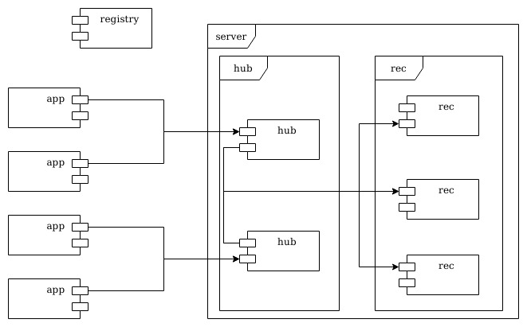

*Bicloin*: segunda parte
========================

O projeto de Sistemas Distribuídos (SD) corresponde ao desenvolvimento do sistema **Bicloin**, que permite gerir uma plataforma de bicicletas partilhadas numa cidade.

Na primeira parte do projeto foi construída uma primeira versão do sistema, com servidores `hub` para armazenar dados imutáveis e validar regras de negócio, com um servidor `rec` para armazenar registos com dados mutáveis, e a aplicação `app` com uma interface-utilizador.

Este documento apresenta os requisitos para a segunda parte do projeto, onde o sistema vai ser estendido para permitir ter várias réplicas de `rec` e oferecer tolerância a faltas no acesso aos dados mutáveis.

1 Replicação com coerência de dados
-----------------------------------

Como vimos na primeira parte e nas aulas teóricas, a replicação tem o benefício de permitir tolerar a falta de servidores.
Por exemplo, na primeira parte do projecto, quando um dos servidores `hub` parava, era possível contactar outro.
No entanto, esta substituição de servidores apenas foi possível de forma trivial porque não existiam variáveis partilhadas entre as diferentes réplicas.
O sistema manteve-se coerente porque a informação mutável estava toda num único `rec`.
No entanto, isto significa que o `rec` é um **ponto central de falha**, isto é, se ele parar, todo o sistema pára, e a informação perde-se.

A informação guardada é muito importante, pois inclui os saldos das contas dos utilizadores e a ocupação das estações de bicicletas.
É muito importante que exista tolerância a faltas no `rec` e que as alterações aos saldos de cada utilizador (*bicloins* gastos e ganhos) não se percam, nem sejam corrompidos.
Por outras palavras, é necessário replicar também o `rec` para ter **tolerância a faltas**, mas é fundamental manter a **coerência dos dados**.

----

2 Arquitetura revista
---------------------

Nesta segunda parte, vão existir várias *réplicas* do `rec`, cada uma com uma cópia integral de todos os dados.
A figura seguinte mostra uma visão global dos componentes da solução.

----

3 Protocolo de replicação
-------------------------

Pretende-se seguir a abordagem de **replicação ativa**, implementando uma variante do protocolo **registo distribuído coerente** (cf. aulas teóricas e secção 18.5.5 do livro Coulouris) para coordenar as leituras e escritas nas réplicas.

O sistema replicado pode assumir que existe um conjunto estático de **N** gestores de réplica, ou seja, instâncias de `rec`, que não muda enquanto o sistema estiver em execução.

Cada grupo deverá considerar variantes do protocolo original que, tendo em conta o cenário específico deste projeto, permitam um melhor desempenho do sistema.
Existem diversas soluções possíveis e este será um fator diferenciador de cada grupo na avaliação.
As opções de implementação devem ser discutidas com os docentes nas aulas de apoio e justificadas no relatório de projeto.

IMPORTANTE: as optimizações não devem pôr em causa a correção do sistema replicado – mais precisamente, a garantia de **coerência sequencial** deve ser sempre preservada.

3.1 Modelo de interação e faltas
--------------------------------

Como modelos de interação e faltas, deve assumir-se que:

- O sistema é assíncrono e a comunicação pode omitir mensagens;

- Os gestores de réplica podem falhar silenciosamente mas não arbitrariamente, i.e., não há falhas bizantinas;

- No máximo, existe uma minoria de gestores de réplica do `rec` em falha em simultâneo;

- As falhas das réplicas do `rec` são transientes e não definitivas;

- Por simplificação, assume-se que as réplicas do `hub` não falham durante o processamento de operações, i.e., não deixam operações inacabadas;

- Embora o conjunto de gestores de réplica seja estático, os seus endereços não são conhecidos _a priori_ e podem variar ao longo do tempo.
As réplicas devem ser descobertas através do serviço de nomes.
Por simplificação, não é necessário tolerar a falta do *ZooKeeper*.

3.2 Implementação da tolerância a faltas
----------------------------------------

As faltas na comunicação devem ser toleradas, com o adequado tratamento de exceções.

A falta silenciosa dos processos pode ser desencadeada terminando o programa abruptamente (por exemplo, fechando a janela do terminal, ou fazendo o comando `kill -9` que envia um `SIGKILL` que, ao contrário do `SIGTERM`, não pode ser tratado).  
É também possível colocar o processo em pausa (utilizando a combinação teclas `Ctrl+Z` no terminal do servidor, ou o comando `kill -20` que envia um `SIGTSTP` ao processo) e resumindo o seu estado posteriormente (escrevendo `fg` no terminal do servidor ou utilizando o comando `kill -18` que envia o signal `SIGCONT`).

Do lado de quem faz as chamadas remotas, o comportamento de tolerância a faltas deve ser encapsulado dentro de um objeto *front-end*, que esconde a existência de réplicas para o resto do código.

Para concretizar o protocolo de replicação, será necessário acrescentar *meta-dados* às operações `read` e `write`.
Esta informação adicional pode ser acrescentada aos *protocol buffers*, uma vez que estes são extensíveis com novos campos, sem quebrar a compatibilidade com os anteriores.

3.3 Análise de desempenho
-------------------------

É desejável que, tanto quanto possível, as opções tomadas privilegiem o desempenho.
Por desempenho, entende-se o **tempo de resposta**, desde o momento em que é feita a chamada remota, até ao momento em que é recebida a resposta.

Sugere-se que se implemente primeiro uma versão simples da solução, sem preocupações maiores de desempenho.
Depois, o código desta primeira solução deve ser instrumentado para medir, por exemplo:
- o tempo de resposta ao pedidos (medido por quem faz as chamadas remotas);
- o número de pedidos `read` e o número de pedidos `write`, para permitir calcular o rácio entre estes procedimentos.

As experiências devem durar algum tempo e ser baseadas em sequências de utilização que correspondam a carregamentos e a viagens de utilizadores.
Para automatizar a execução das experiências, conferir novamente a sugestão de uso do operador de redireccionamento na aplicação (`< commandos.txt`).

Na posse de dados de desempenho, cada grupo deverá então desenhar e depois implementar otimizações.
É importante que se confirme que as otimizações foram eficazes, com novas experiências e medições.

### 3.3.1 Invocações em paralelo a todas as réplicas

Sempre que seja necessário contactar várias réplicas será vantajoso, à partida, que os pedidos sejam feitos em paralelo.
Aqui o desafio será fazer chamadas *gRPC* assíncronas e coordenar a receção de respostas, fazendo uso correto de mecanismos de sincronização do *Java*.

### 3.3.2 Pesos diferenciados

No contexto do protocolo de registo coerente, é possível ter quóruns diferentes para as operações de leitura e as operações de escrita.
Por omissão, as operações têm o mesmo peso.
É também possível ter pesos diferentes para cada réplica.
Por omissão, as réplicas têm o mesmo peso.
Com base nas medições a efetuar, poderá fazer sentido alterar as definições por omissão.

----

4 Resumo
--------

Em resumo, na segunda parte do trabalho, é necessário manter a funcionalidade da primeira parte, criar várias réplicas do `rec` e implementar o protocolo de registo distribuído coerente para leituras e escritas de valores, com tolerância a faltas.
Adicionalmente, deverão ser concretizadas otimizações, tendo por base medições recolhidas no sistema em funcionamento.
As opções de implementação devem ser bem justificadas no relatório.

----

5 Avaliação
-----------

5.1 Entrega
-----------

A segunda entrega do projeto será feita através do repositório Git do grupo, antes da hora limite de entrega.
O grupo deve marcar o código a entregar com uma [*tag*](https://git-scm.com/book/en/v2/Git-Basics-Tagging) específica: `SD_P2`.

5.2 Valorização
---------------

A segunda parte vale 10 valores em 20, distribuídos da seguinte forma:

- Correção de erros da primeira parte (1 valor)

- Replicação do *rec* em múltiplos servidores (1 valor)

- Leituras coerentes (1 valor)

- Escritas coerentes  (1,5 valores)

- Otimizações de desempenho (1,5 valores)

- Relatório e demonstração (2 valores)

- Qualidade do código -- os mesmos aspetos da primeira parte -- em todos os componentes (2 valores)

A data limite de entrega é: **sexta-feira, 7 de maio de 2021, 17:00**.

5.3 Relatório
-------------

Na segunda parte, além do código-fonte, deve também ser elaborado e entregue um relatório em formato [*MarkDown*](https://guides.github.com/features/mastering-markdown/).

O documento tem que chamar-se `report/README.MD`, de acordo com a [estrutura de exemplo](report/README.md).  
As imagens e restantes recursos devem também ser colocados na pasta `report/`.

Conteúdos obrigatórios:

- Identificador do grupo em formato *CXX*, fotos, números e nomes dos membros do grupo (ordenados por número de estudante crescente)

- Definição do modelo de faltas (que faltas são toleradas, que faltas não são toleradas);

- Figura da solução de tolerância a faltas;

- Breve explicação da solução, suportada pela figura anterior;

- Explicação do protocolo em detalhe (descrição das trocas de mensagens);

- Tabela-resumo dos dados de desempenho recolhidos, com breve explicação;

- Descrição de opções de implementação, incluindo otimizações e melhorias introduzidas.

O relatório deve ter entre 1500 e 2000 palavras.
<!-- 2-3 páginas, assumindo 500 palavras por página A4 -->

O formato sugerido para a figura é um diagrama UML de colaboração, que representa simultaneamente a estrutura e o comportamento da solução, de forma sucinta.
Pode também ser um diagrama de sequência da parte mais importante do protocolo, ou outro esquema feito pelo grupo, desde que devidamente legendado.

5.4 Demonstração
----------------

As instruções de instalação e configuração de todo o sistema, elaboradas na primeira parte, devem ser atualizadas no documento `demo/README.md`.  

Para a segunda parte deve ser criada uma **nova secção** no guião, dedicada à **replicação e tolerância a faltas**.
Nesta nova secção, devem ser indicados os comandos para: lançar réplicas, fornecer dados, fazer interrogações, etc.
Deve também ser indicado o que se espera que aconteça em cada caso.  
O guião de demonstração deve apresentar situações de *funcionamento normal com replicação* e também situações de *tolerância a faltas*.

Tenham em conta que a demonstração do trabalho será realizada ao vivo, antes da discussão, seguindo as instruções indicadas no guião entregue.  
A duração total da demonstração da segunda parte deve ser inferior a 5 minutos.

Para permitir observar o que se passa "dentro" de cada programa do projeto, é muito importante que cada componente imprima mensagens para a consola.
As mensagens devem ser sucintas mas informativas, descrevendo o passo do protocolo que está a decorrer, como se cada componente contasse o que está a fazer e porquê.

Exemplos de boas mensagens (meramente ilustrativas):

* _"Replica 2 starting..."_
* _"Contacting replica 1 at localhost:8091… sending 'X'..."_
* _"Received 'Y'..."_
* _"Caught exception 'Z' when trying to contact replica 3 at localhost:8093"_
* _"Frontend received answer with tag ..."_

É muito **importante** que os programas indiquem quem são e qual o servidor - máquina e porto - a que se estão a ligar.

5.5 Discussão
-------------

Todos os estudantes têm que ser avaliados individualmente na discussão final do projeto.
As notas das várias partes são indicativas e sujeitas a confirmação na discussão final, na qual todo o trabalho desenvolvido durante o semestre será tido em conta.
É muito importante que a divisão de tarefas ao longo do trabalho seja equilibrada pelos membros do grupo.

Todas as discussões e revisões de nota do trabalho devem contar com a presença obrigatória de todos os membros do grupo, quer se realizem ao vivo, quer se realizem por teleconferência com vídeo.

5.6 Atualizações
----------------

Para acompanhar as novidades sobre o projeto, consultar regularmente a página dos laboratórios.
Caso venham a surgir correções ou clarificações neste documento, podem ser consultadas no histórico (_History_).

**Bom trabalho!**
